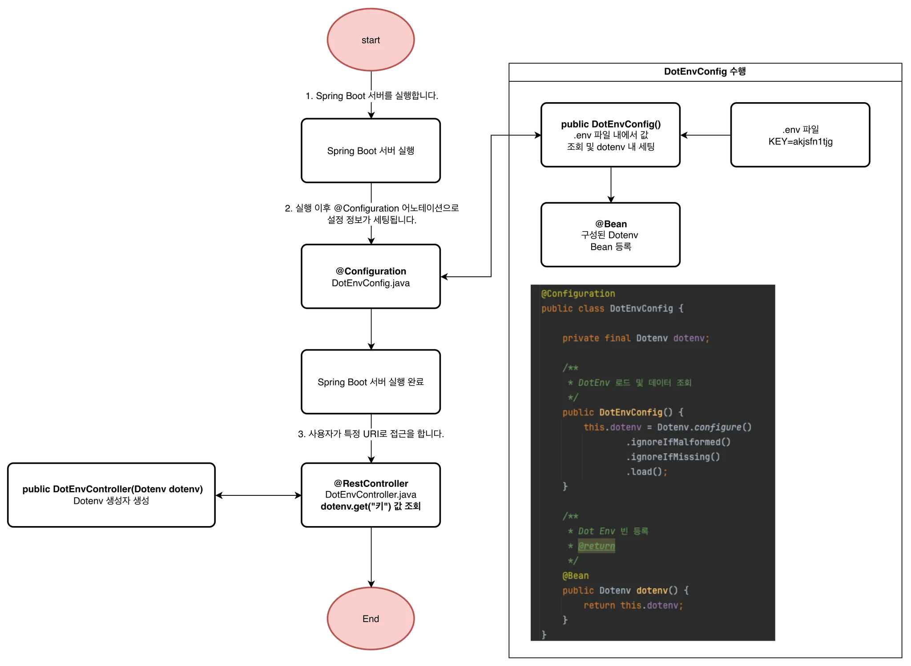
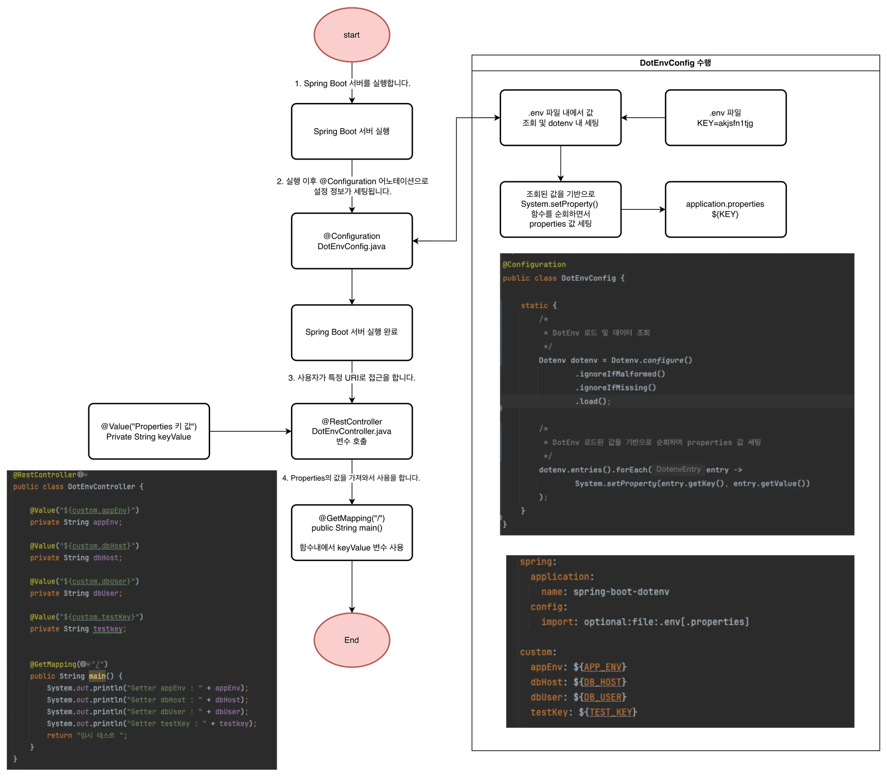
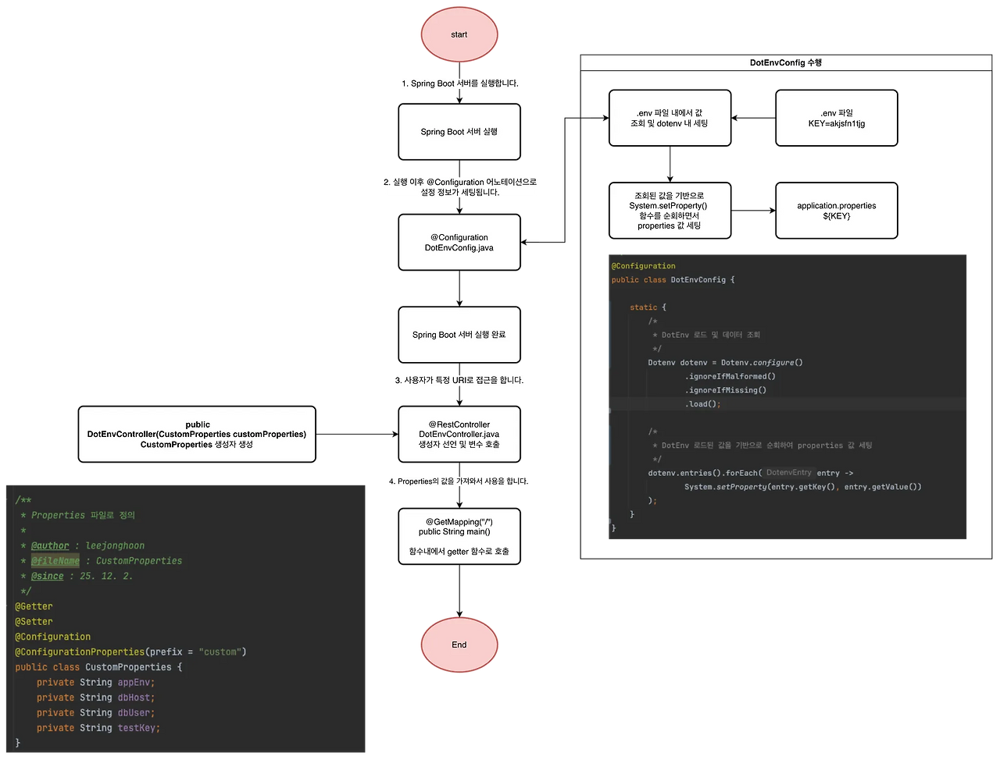

## Spring Boot Dotenv

    ⭕️ Spring Boot 환경에서 io.github.cdimascio:dotenv-java 오픈소스 라이브러리를 활용하여서 .env 파일을 불러오는 위한 방법에 대한 예시들을 구성한 Repository입니다.

 

🔗 가이드 링크

- [Spring Boot Dotenv 이해하고 활용하기 -1 : .env 로드, .yml 매핑 로드](https://adjh54.tistory.com/727)

## 1. 개발환경

| 환경 분류                           | 버전      |
|---------------------------------|---------|
| JDK                             | Java 17 |
| spring-boot                     | 3.5.8   |
| spring-boot-starter-web         | 3.5.8   |
| io.github.cdimascio:dotenv-java | 3.2.0   |
| spring-boot-starter-test        | 3.3.1   |
| Lombok                          | -       |

## 2. API Endpoint

| Endpoint        | HTTP Method | 설명                                          |
|-----------------|-------------|---------------------------------------------|
| /api/v1/env/env | -           | .env 파일 자체를 가져오기 위한 예시 엔트포인트입니다.            |
| /api/v1/env/yml | -           | .env 파일을 yml 파일로 매핑한 뒤 가져오기 위한 예시 엔드포인트입니다. |

## 3. 프로세스

### 3.1. .env 파일 정보 가져오기 프로세스
    프로세스 확인

    1. Spring Boot 서버를 실행합니다

    2. 서버 실행 이후 @Configuration 어노테이션으로 설정 정보가 세팅이 됩니다.

    - 사용자 지정한 DotEnvCofig.java 파일 내에 함수가 실행이 됩니다 .

    — 정적블록(static{})을 이용하여서 클래스가 처음 로딩될때 한 번만 실행하도록 합니다.
    — Dotenv 객체를 로드해옵니다.
    — DotEnv 로드된 값을 기반으로 순회하여 properties 값 세팅합니다.

    - Spring Boot 서버가 실행이 완료가 되었을때, 값은 application.yml 파일 내에 모두 세팅이 된상태입니다.

    3. 사용자가 특정 URI로 접근을 합니다.

    - @Value를 통해서 매핑된 yml 파일내에 application.yml 파일 내의 속성을 각각 조회합니다.
    - 최종적으로 데이터가 조회가 됩니다.

 

### 3.2. .env 파일을 yaml 파일 내 매핑(@Value 로드)
    프로세스 확인

    1. Spring Boot 서버를 실행합니다

    2. 서버 실행 이후 @Configuration 어노테이션으로 설정 정보가 세팅이 됩니다.

    - 사용자 지정한 DotEnvCofig.java 파일 내에 함수가 실행이 됩니다 .

    — 정적블록(static{})을 이용하여서 클래스가 처음 로딩될때 한 번만 실행하도록 합니다.
    — Dotenv 객체를 로드해옵니다.
    — DotEnv 로드된 값을 기반으로 순회하여 properties 값 세팅합니다.

    - Spring Boot 서버가 실행이 완료가 되었을때, 값은 application.yml 파일 내에 모두 세팅이 된상태입니다.

    3. 사용자가 특정 URI로 접근을 합니다.

    - @Value를 통해서 매핑된 yml 파일내에 application.yml 파일 내의 속성을 각각 조회합니다.
    - 최종적으로 데이터가 조회가 됩니다.

 

### 3.3. .env 파일을 yaml 파일 내 매핑(Properties 로드)

    💡 프로세스 확인

    1. Spring Boot 서버를 실행합니다

    2. 서버 실행 이후 @Configuration 어노테이션으로 설정 정보가 세팅이 됩니다.

    - 사용자 지정한 DotEnvCofig.java 파일 내에 함수가 실행이 됩니다.
     2.1. 정적블록(static{})을 이용하여서 클래스가 처음 로딩될 때 한 번만 실행하도록 합니다.
     2.2. Dotenv 객체를 로드해 옵니다.
     2.3. DotEnv 로드된 값을 기반으로 순회하여 properties 값 세팅합니다.

    - Spring Boot 서버가 실행이 완료가 되었을 때, 값은 application.yml 파일 내에 모두 세팅이 된 상태입니다.

    3. 사용자가 특정 URI로 접근을 합니다.
    - @Value를 통해서 매핑된 yml 파일 내에 application.yml 파일 내의 속성을 각각 조회합니다.**최종적으로 데이터가 조회가 됩니다.

