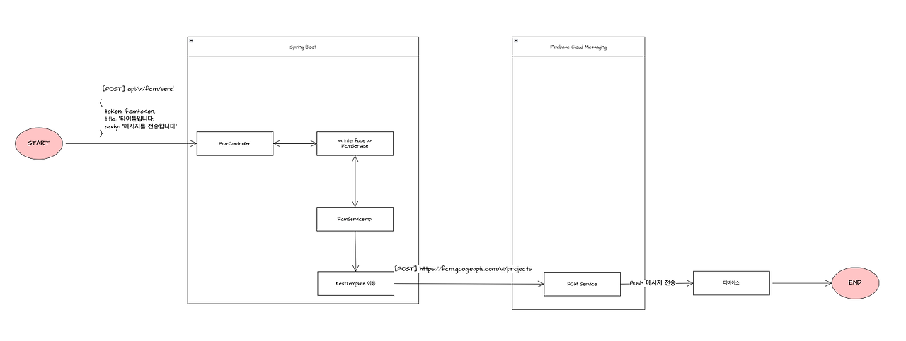
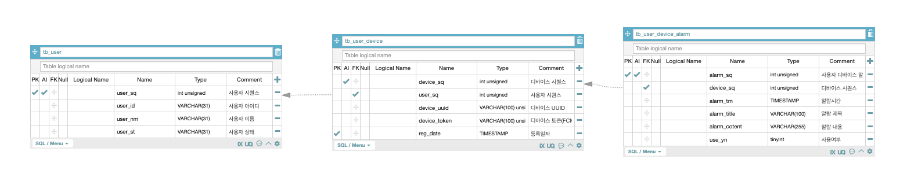

# Spring Boot Scheduler

    ⭕️ Spring Boot Scheduler : Spring Boot Quartz을 이용한 FCM 메시지 예약 발송 기능 

<br/>
<br/>


⭕️ 가이드 링크

* [Spring Boot Firebase Cloud Message(FCM) 푸시 메시지 API 구축 -1 : firebase-admin](https://adjh54.tistory.com/432)
* [Spring Boot Firebase Cloud Message(FCM) 구축 -2 : 예약 발송](https://adjh54.tistory.com/438)

## 1. 개발환경

| 환경 분류                                               | 버전      |
|-----------------------------------------------------|---------|
| JDK                                                 | Java 17 |
| spring-boot                                         | 3.2.5   |
| spring-boot-starter-web                             | 3.2.5   |
| spring-boot-starter-data-jdbc                       | 3.2.5   |
| spring-boot-starter-quartz                          | 3.2.5   |
| Lombok                                              | -       |
| com.google.firebase:firebase-admin                  | 9.2.0   |
| org.mybatis.spring.boot:mybatis-spring-boot-starter | 3.0.3,  |

<br /><br />

## 2. 수행 과정

### 2.2. 전체 수행 과정

    💡 전체 데이터 흐름

    1. Spring Boot FcmController로 API를 호출합니다.   
    - HTTP Method POST 형태로 구성한 ‘api/v1/fcm/send’로 FCM 토큰(디바이스에서 발급받은 토큰), 푸시 메시지 제목, 내용을 파라미터로 전달합니다.

    2. FcmServiceImple
    - FCM과 통신하는 URL로 해당 메시지 정보를 전달합니다. 해당 통신 방법은 RestTemplate을 이용하여 동기식 전송을 수행하였습니다.

    3. FCM Service
    - FCM Service에서는 전달받은 토큰에 따라 디바이스로 푸시 메시지를 전송하고 종료합니다.



<br/>
<br/>

### 2.2. Spring Boot Quartz 기반 수행과정

    💡 전체 프로세스
    
    - 전반적인 프로세스를 확인해 봅니다.
    
      1. Spring Boot Application 실행
      - Spring Boot Application Server가 시작되는 동시에 스케줄러가 수행이 됩니다.
    
    
    2. SchedulerConfiguration 클래스 실행
       - 해당 클래스에서 @Configuration 어노테이션으로 지정되었기에 서버가 실행되고 수행이 됩니다. 또한 해당 클래스는 WebMvcConfigurer 인터페이스의 구현체로 구성합니다.
    
    
    3. configScheduler 함수 실행
       - @PostConstruct으로 지정하여 빈 객체의 초기화과 모두 완료된 후 호출됩니다.
    
    
    4. configScheduler 함수 : JobDetail 구성
       - 스케줄러를 처리하기 위한 Job을 구성하며 JobDetail의 인스턴스를 구성합니다.
       - 해당 Job 내에서 전송을 보낼 목록을 조회하여 조회된 목록 중 FCM Token 값을 받아서 실제 FCM API를 호출하여 FCM 메시지를 전송합니다.
    
    
    5. configScheduler 함수 : Trigger 구성
       - SimpleScheduler를 이용하여 구성하였습니다. 시간과 반복여부를 지정한 뒤 트리거 인스턴스 생성합니다.
    
    
    6. configScheduler 함수 : Scheduler 구성
       - 스케줄러의 생명주기를 관리하는 리스너를 등록하고 실제 스케줄러를 실행시킵니다.
    
    
    7. Scheduler 시작
       - 구성한 JobDetail, Trigger를 기반으로 스케줄링을 시작합니다.


<br />
<br />

### 2.3. 수행 테이블 확인

    ⭕️ 테이블간의 구조는 사용자 테이블(tb_user)이 여러개의 사용자 디바이스 테이블(tb_user_device)을 가지는 구조이며, 
    디바이스 별로 여러개의 알람을 지정할 수 있는 사용자 디바이스 알람(tb_user_device_alram) 테이블을 가지는 구조입니다,.



<br />
<br />

## 3. 사용방법

    ⭕️ 해당 구성한 스케줄러 테스트를 위해서 필요작업

1. Google Firebase 내에 프로젝트 생성
2. Google Firebase 내의 비공개 키 발급 및 프로젝트 내에 이식
3. 디바이스에 대한 FCM 토큰 정보가 필요함.
4. 테이블 셍성(tb_user, tb_user_device)

```sql
   -- 사용자 테이블
CREATE TABLE tb_user
(
    user_sq int unsigned NOT NULL AUTO_INCREMENT COMMENT '사용자 시퀀스',
    user_id VARCHAR(31) NOT NULL COMMENT '사용자 아이디',
    user_nm VARCHAR(31) NOT NULL COMMENT '사용자 이름',
    user_st VARCHAR(31) NOT NULL COMMENT '사용자 상태',
    PRIMARY KEY (user_sq)
);

-- 사용자 디바이스 테이블
CREATE TABLE tb_user_device
(
    device_sq    int unsigned NOT NULL AUTO_INCREMENT COMMENT '디바이스 시퀀스',
    user_sq      int unsigned NOT NULL COMMENT '사용자 시퀀스',
    device_uuid  VARCHAR(100) unsigned NOT NULL COMMENT '디바이스 UUID',
    device_token VARCHAR(100) unsigned NOT NULL COMMENT '디바이스 토큰(FCM Token)',
    reg_date     TIMESTAMP NOT NULL COMMENT '등록일자'
   PRIMARY KEY (device_sq)
);

-- 사용자 디바이스 알람 테이블
CREATE TABLE tb_user_device_alarm
(
    alarm_sq      int unsigned NOT NULL AUTO_INCREMENT COMMENT '사용자 디바이스 알람 시퀀스',
    device_sq     int unsigned NOT NULL COMMENT '디바이스 시퀀스',
    alarm_tm      TIMESTAMP    NOT NULL COMMENT '알람 시간',
    alarm_title   VARCHAR(100) NOT NULL COMMENT '알람 제목',
    alarm_content VARCHAR(255) NOT NULL COMMENT '알람 내용',
    use_yn        tinyint      NOT NULL default = 1 COMMENT '사용여부',
    PRIMARY KEY (alarm_sq)
);
```

<br/>

5. 테이블 내의 Dummy 데이터 생성

```sql
   -- 사용자 정보 등록
INSERT INTO tb_user(user_id, user_nm, user_st)
-- VALUES('adjh54', '박철수', 'A');
-- VALUES('ckas123', '홍길동', 'A');
VALUES ('kim9090', '김미미', 'A');

-- 사용자 디바이스 등록
INSERT INTO tb_user_device(user_sq, device_token, device_uuid, reg_date)
VALUES (1, 'sdflkjsdfnmxcvqiiwiwixncvnnvnsdllflfnlgnlg', 'GJRNGNNBNF', CURRENT_TIMESTAMP);

-- 사용자 디바이스 알람 등록
INSERT INTO tb_user_device_alarm(device_sq, alarm_tm, alarm_title, alarm_content)
VALUES (1, CURRENT_TIMESTAMP, '알람 제목', '알람 내용');
```

6. 해당 데이터가 모두 들어가 있다면 tb_user_device 테이블 내에 device_token 컬럼의 값을 디바이스 기기에서 발급받은 토큰 값을 넣고 alarm_tm 값을 전송하고자 하는 시간으로 맞추면
   FCM 전송이 수행됩니다. 
