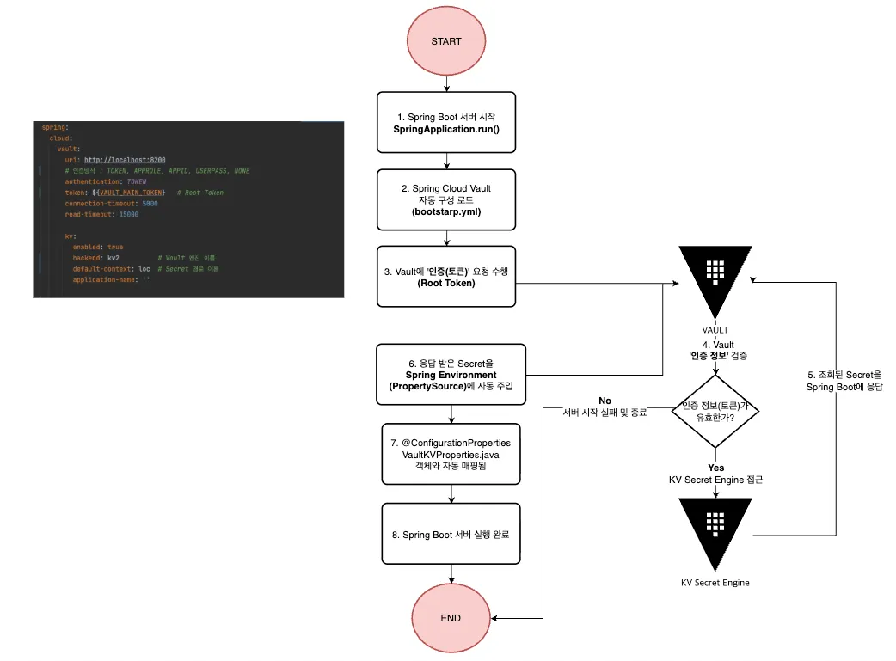
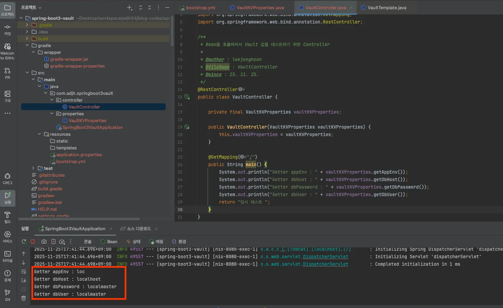

# Spring Boot3 Vault

    ⭕️ Spring Boot Cloud Vault & Bootstrap 활용하는 예시를 담은 Repository 입니다.

 

🔗 가이드 링크

- [Spring Cloud Vault 이해하고 활용하기-1 : 최초 KV 구성 및 토큰 인증 방식 이용](https://adjh54.tistory.com/728)

 
 

## 1. 개발환경

| 환경 분류                             | 버전       |
|-----------------------------------|----------|
| JDK                               | Java 17  |
| spring-boot                       | 3.5.8    |
| spring-cloud                      | 2025.0.0 |
| spring-cloud-starter-vault-config | 2025.0.0 |
| spring-cloud-starter-bootstrap    | 2025.0.0 |
| Lombok                            | -        |

 
 

## 2. API Endpoint

| Endpoint         | HTTP Method | 설명                                |
|------------------|-------------|-----------------------------------|
| /api/v1/vault/kv | GET         | Vault에서 조회해온 KV 값을 조회하는 엔드포인트입니다. |

 
 

## 3. 프로세스 : Token 인증 KV Engine 데이터 조회 

    - 최초 Spring Boot 서버가 실행되면서 아래의 프로세스가 동작을 합니다.

    1. Spring Boot 서버 시작: SpringApplication.run()
    - 최초 Spring Boot 서버가 실행이 됩니다.

    2. Spring Cloud Vault 자동 구성 로드: bootstrap.yml
    - Spring Cloud Bootstrap에서 최초 Vault 설정에 대한 자동 구성이 로드가 됩니다.

    3. Vault에 '인증(토큰)' 요청 수행 : Root Token
    - Vault의 인증 방식 중 토큰을 이용한 방식에서도 Root Token을 통해서 Vault에 인증을 요청합니다.

    4. Vault '인증 정보' 검증
    - Vault에서는 유효한 토큰인지에 대해 인증 정보에 대해 검증을 합니다.
    - 성공 시, KV Secret Engine에 접근합니다.
    - 실패 시, 서버 시작 실패와 종료를 합니다.

    5. 조회된 Secret을 Spring Boot에 응답
    - KV Secret Engine에서 조회된 정보를 응답으로 전달합니다

    6. 응답받은 Secret을 Spring Environment(PropertySource)에 자동 주입
    - Spring Boot에서는 전달받은 Secret을 Spring Environment(PropertySource)에 자동 주입을 합니다.

    7. @ConfigurationProperties VaultKVProperties.java 객체와 자동 매핑
    - 추후에 구성할 VaultKVProperties.java 파일 내에 사전에 KV와 같은 형태로 구성한 멤버 변수 각각에 데이터가 매핑이 됩니다.

    8. Spring Boot 서버 실행 완료
    - 최종 작업이 완료되어서 Spring Boot 서버가 실행이 완료가 됩니다.

 

## 4. 결과 화면

